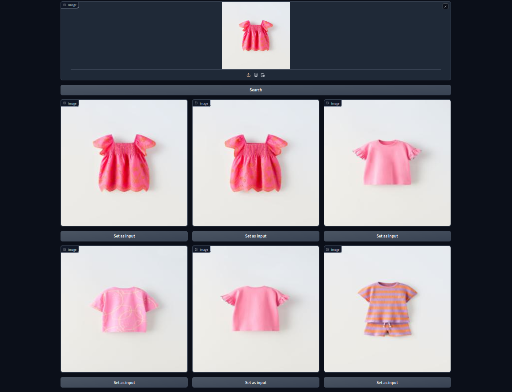

# hackupc24_inditex
The project challenge of INDITEXTECH at HackUPC 2024.

In this project, we have attempted to address the issue of image duplication in datasets. The objective is to detect similar or duplicate images in a dataset with high accuracy, while also minimizing the time and computational power required.

To solve this problem, we have divided it into several parts: feature extraction, grouping of features, and identification of clusters. And after looking only inside these clusters if we have similar of same images.

For feature extraction, we have used a pretrained CNN model, ResNet, which was originally trained on the ImageNet dataset. We have decided to use extract features by CNN, because CNN has ability to extract important features from images automatically. We don't have to tell explicitly which features to use, it automatically find which featurers are important. We then fine-tuned it with our dataset, which improved the results in some cases. Although this model is designed primarily for image classification, we have adapted it slightly for feature extraction. The full model contains 11 million parameters. As we aim to minimize computational time, we used only the first few layers of the network, which significantly reduced the number of parameters. After this modification, our model has 683,072 parameters, , demonstrating a substantial reduction.

Once we have extracted our features, we could use another deep learning framework to find similar or duplicate images, or we could even train ResNet to do this as well. However, pursuing this direction presents challenges; initially, we would need a significant amount of data to train our model, followed by extensive computation for training. Moreover, once this model is trained, substantial computational power would be required at inference time due to the large number of parameters. To avoid these issues, we are using CNN solely for feature extraction, and then applying simpler techniques to identify similar or duplicate images.

In this case, when we extract features with a CNN, we obtain a vector of 128 elements, which is not very large. This means we can work directly with this vector. After using cosine similarity to determine whether two vectors are similar, we achieve good results. We have tested this with approximately 10,000 images, and it takes about 1 second or even less. The feature extraction process is also very fast, because our CNN model for feature extraction is quite small, allowing it to compute features quickly. This suggests that we can use this approach even if we have hundreds of thousands of images, and it should still perform quite efficiently.

In cases where we are dealing with millions of images, we recommend an additional approach between feature extraction and cosine similarity to enhance performance: clustering elements. Our strategy involves grouping the data into clusters. When a new data point is introduced in the future, we will determine which cluster this point belongs to and compare it only with the images within that cluster. This method significantly reduces the number of images we need to compare for similarity. While there may be a slight decrease in accuracy, this approach will greatly increase efficiency when handling millions of images.
The entire process was carried out on personal computers or Google Colab. We did not use any cloud services or external GPUs to train our models.
